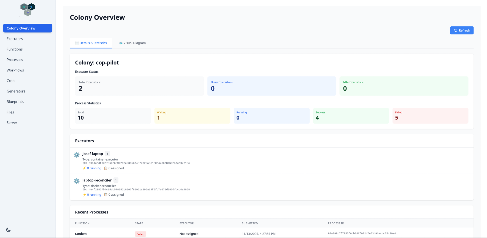
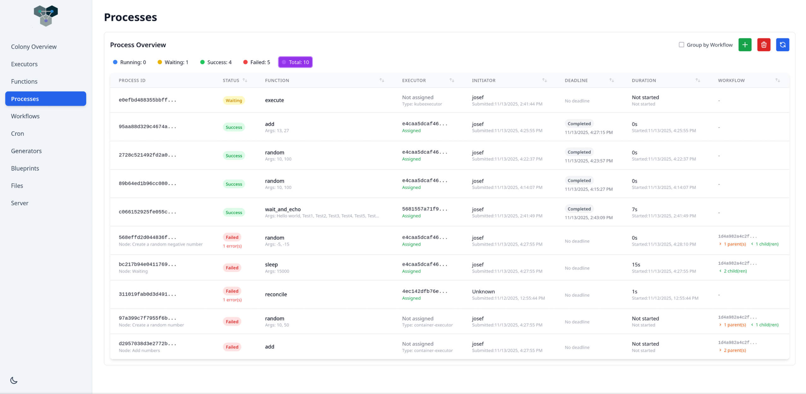
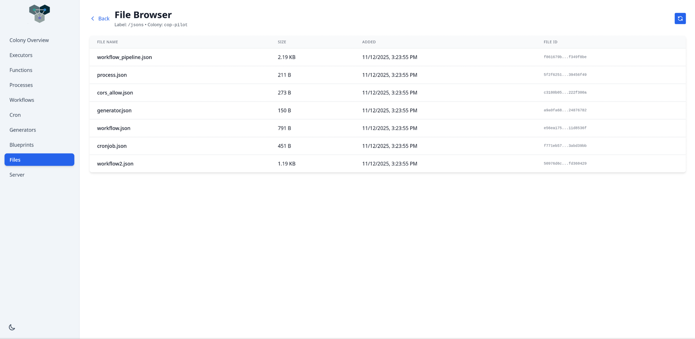

# Colonies Dashboard

The goal is to provide a web interface for a colony with some control of resources.

This was created with Claude code

## Images







## TODOs

- Colony visualization
- Follow process after submission (websocket)

## Running

### Docker container

Build container image with

```bash
make container
```

Source the required env vars

``` bash
# Backend Configuration
COLONY_BACKEND_HOST=host.docker.internal
COLONY_BACKEND_PORT=50080
COLONY_BACKEND_TLS=false

# Colonies Configuration
COLONIES_COLONY_NAME=your-colony-name
COLONIES_SERVER_PRVKEY=your-server-private-key
COLONIES_COLONY_PRVKEY=your-colony-private-key
COLONIES_PRVKEY=your-user-private-key

# S3 Configuration (Optional)
AWS_S3_ENDPOINT=https://s3.amazonaws.com
AWS_S3_ACCESSKEY=your-access-key
AWS_S3_SECRETKEY=your-secret-key
AWS_S3_REGION=us-east-1
AWS_S3_BUCKET=your-bucket-name
AWS_S3_TLS=true
AWS_S3_SKIPVERIFY=false
```

Start the container with the compose file

```bash
docker compose up -d
```

Now you can browse to localhost and you should see the dashboard.
